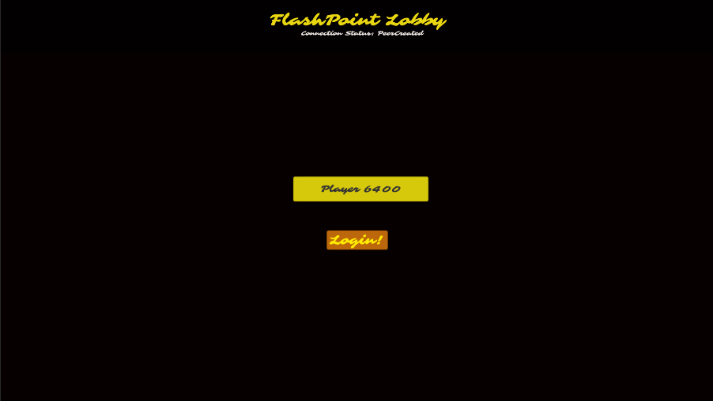
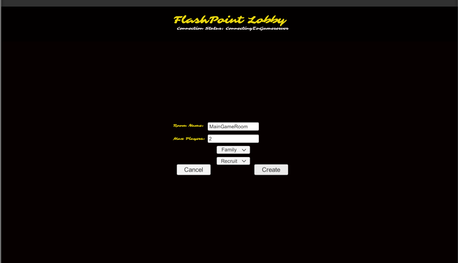
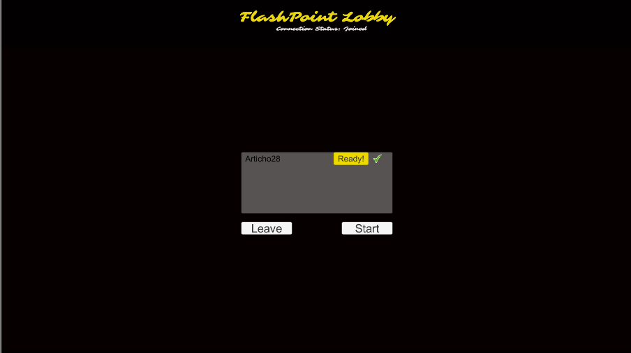
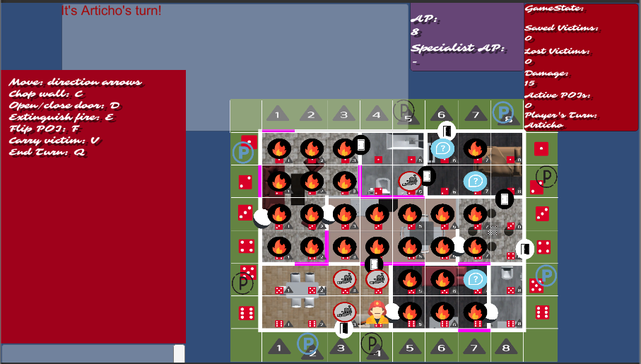
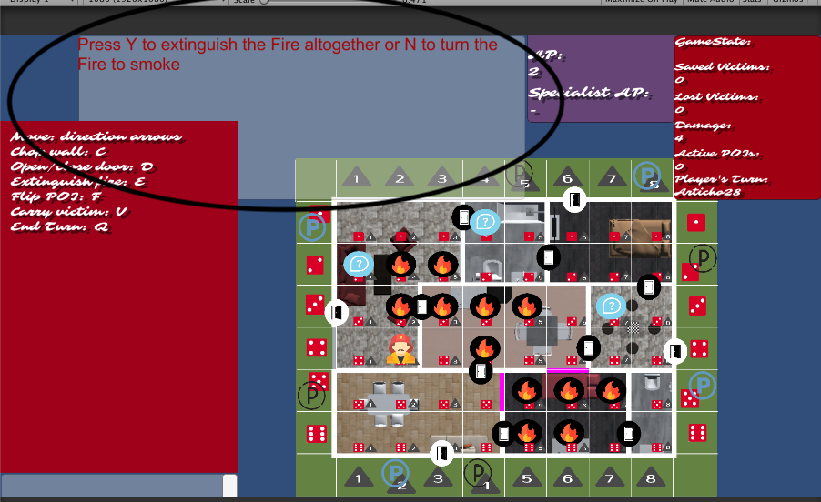
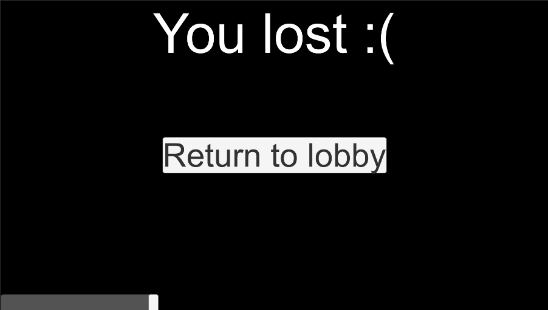
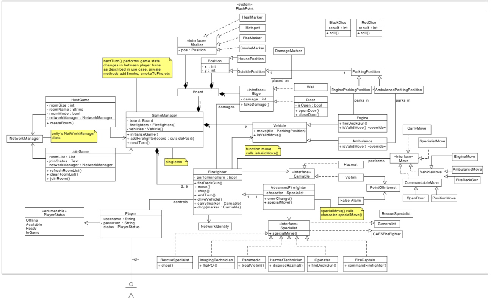
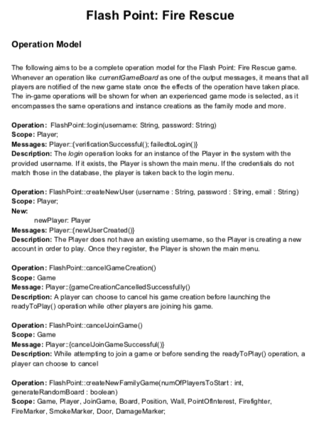

# FLASHPOINT FIRE RESCUE ONLINE GAME

### Multiplayer game developed in a team in the context of COMP 361: Software Engineering Project using C# and Unity. 

Went through the entire development process of the game: from class diagrams to sequence diagrams to implementation! 

My contributions: 
- Redacted the Operations Model
- Created Concept Model 
- Implemented lobby matchmaking, integration with cloud services
- Implemented all rules related to initial placement, fire advancement, and explosions. 

### Game Preview 

### Concept Model

### Operation Model Preview

